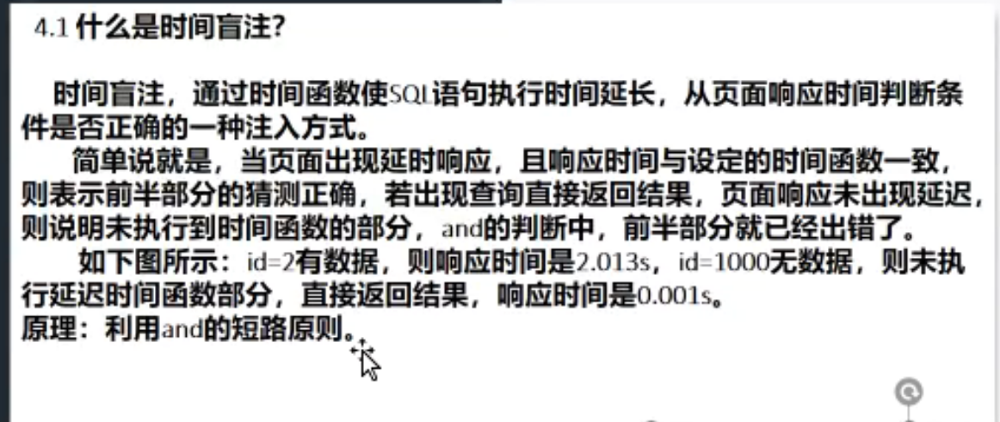

# SQL注入原理讲解

## 数据库的分类

* 关系型数据库
* 非关系型数据库

## SQL注入原理

开发者编辑时对sql语句进行不当的拼接和过滤。

### 产生过程及常见原因

web需要与数据库连接并交互

#### 转义字符处理不合适

单引号的问题

#### 不安全的数据库配置

默认的账户名和密码

MYSQL使用“root”“anonymous”

MYSQL服务器元数据位于information\_schema，可以通过show database和show table；命令访问

#### 不合理的查询集处理

A向B传输数据，C将数据替换

#### 不当的错误处理

#### 多个提交处理不当

### SQL注入的几种类型

#### 布尔型盲注入

页面中不会显示数据库的信息，只会显示对与错的信息

1. 布尔型盲注入
2. 延时注入


时间盲注：通过时间函数使sql语句执行时间延长，从页面响应时间判断条件是否正确的一种方式。



.png>)


区别：

布尔盲注：利用页面返回判断

时间盲注：利用时间返回判断

可以布尔盲注的一定可以时间盲注，可以时间盲注的不一定可以布尔盲注。

时间盲注不会返回错误信息，优先使用布尔盲注。


盲注：sql语句不能回显到前端页面，利用一些方法来判断是否成功

.png>)

.png>)

.png>)

.png>)

.png>)

.png>)

.png>)

.png>)

.png>)

### 小知识

#### id-1，如果页面返回正确说明有注入，+1可以么？

不可以，加号在url中是空格的意思

#### mysql有几种注释方式

.#直到该行注释结束

.-+注释直到该行结束（空格会被浏览器处理，所以用+代替空格）

./注释多行/.

#### “select select \* from admin”可以执行么？

不可以

#### 那些可以绕过空格过滤？

%09 %0A /\*\*/&#x20;

#### Windows下oracle数据库是什么权限

#### sql注入和sql盲注有何差别？

常规sql注入中，应用返回数据库中的数据并呈现

sql盲注漏洞中，攻击者无法查询检索结果

#### 什么是引发sql注入漏洞的主要原因？

web应用未对用户提供的数据进行充分审查，以及未对输出编码是主要原因。

#### 什么是叠堆查询？

在单个数据库连接中，执行多个查询序列

#### /\*!...\*/是什么意思

select 1/40119+1

#### 如果注入语句中的‘=’被过滤

#### sql注入中的‘+’

